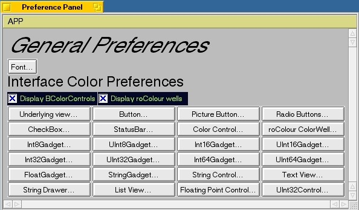

# BeGUI
BeGUI is a simple to use programmer's tool which allows for rapid development
of a program.

Building
--------

Simply go into BeGUI directory and type ``bash creationx86.script``.

Copyright
------------

Original 1999 version by Ed Musgrove, enhanced and updated for Haiku in 2018 by Arnav Bhatt.
